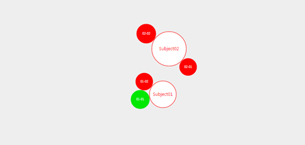

# angular-d3-cluster   #
==================

A simnple cluster chart directive

[D3][d3-url] is the widely known as chart toolset. And also very complicated to learn.

Base on that, my team ask for a simple web component for displaying a cluster chart.

This component is inspired by [vwolfley][vwolfley-url]'s [d3.js.cluster][d3.js.cluster-url].



Online Demo: [angular-d3-cluster](http://leftstick.github.io/angular-d3-cluster/)

## Requirement ##

- [angular][angular-url]
- [d3][d3-url]

## Install ##

```powershell
bower install --save angular-d3-cluster
```

## Basic Usage ##

```html
<div ng-cluster data="data" option="option"></div>
```

```javascript
'use strict';
var demo = angular.module('demo', ['angular-d3-cluster']);

demo.controller('DemoController', function($scope) {
    $scope.option = {
        subjectRange: [15, 30],
        arounderRange: [5, 15]
    };
    $scope.data = [{
        name: 'Subject01',
        value: 10.0,
        children: [{
            name: 'Around01-01',
            value: -5.1
        }, {
            name: 'Around01-02',
            value: 3.1
        }]
    }, {
        name: 'Subject02',
        value: 12.5,
        children: [{
            name: 'Around02-01',
            value: 3.1
        }, {
            name: 'Around02-02',
            value: 6.1
        }]
    }];
});

```

## API ##

### option ###

| Attribute        | Type           | Required  | Default  | Description |
| :------------- |:-------------| :------ | :------ | :-----|
| padding | number | No | 1.5 | separation between same-color circles |
| clusterPadding | number | No | 40 | separation between different-color circles|
| subjectRange | array | No | [30, 45] | limit the subject size |
| arounderRange | array | No | [10, 25] | limit the arounder size |
| maxRadius | number | No | 45 | The max size of a subject or arounder |
| subjectFontSize | number | No | 12 | The font-size of subject text |
| arounderFontSize | number | No | 8 | The font-size of arounder text |
| onSubjectClick | function | No | No | The `subject` passed in the callback while clicking subject |
| onArounderClick | function | No | No | The `arounder` passed in the callback while clicking arounder |


> Once the `data` or `option` is modified, the chart will be redrawn  
> Once the `window` resized, the chart will be redrawn


[d3-url]: http://d3js.org/
[vwolfley-url]: https://github.com/vwolfley
[d3.js.cluster-url]: https://github.com/vwolfley/d3.js.cluster
[angular-url]: https://angularjs.org/

## LICENSE ##

[MIT License](https://raw.githubusercontent.com/leftstick/angular-d3-cluster/master/LICENSE)
